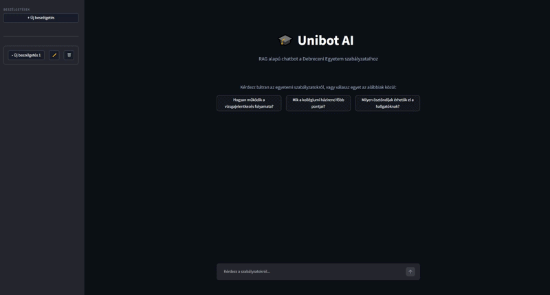

# 🎓 DE UNIBOT AI

[](https://www.python.org/)
[](https://streamlit.io/)
[](LICENSE)
[](Dockerfile)
[](https://en.wikipedia.org/wiki/Retrieval-augmented_generation)

<p align="center">
  
</p>

> Sötét módos Streamlit felület előre definiált gyorsgombokkal, azonnali szabályzatalapú válaszokkal.

---

## 📖 Áttekintés

A **DE UNIBOT AI** egy **RAG (Retrieval-Augmented Generation)** architektúrájú chatbot, amely a Debreceni Egyetem hivatalos szabályzatait és dokumentumait dolgozza fel egy lokális vektoradatbázisban. Ahelyett, hogy az AI általános tudására hagyatkozna, a rendszer először szemantikailag kikeresi a releváns szabályzatrészleteket, majd **kizárólag ezek alapján** generál precíz, kontextusfüggő válaszokat — kiküszöbölve ezzel a hallucinációt és biztosítva a forrásalapú, auditálható információátadást.

A projekt gyakorlati üzleti értéke abban rejlik, hogy akár **több ezer oldalnyi belső szabályzatból** képes másodpercek alatt értelmezhető választ adni, jelentősen csökkentve a hallgatói/adminisztratív támogatás terhelését.

---

## 🚀 Fő Funkciók

- **📄 Dokumentum-alapú válaszadás** — a ChromaDB vektoradatbázisból kinyert releváns szabályzatrészletekből épít választ, forráshivatkozással
- **🧠 RAG architektúra** — különválasztja a tudásbázist (szabályzatok) a generatív modelltől (Gemini 2.5 Flash), így a válaszok auditálhatók és hallucinációmentesek
- **🌐 Magyar nyelvi optimalizáció** — a multilingual embedding modell (`paraphrase-multilingual-MiniLM-L12-v2`) 50+ nyelvet támogat, magyar szövegekre optimalizált mondathatár-kezeléssel
- **🔄 Inkrementális indexelés** — a vektoradatbázis SHA-256 manifest alapján csak a módosult PDF-eket indexeli újra, így a frissítés gyors és erőforrás-hatékony
- **💬 Interaktív chat UI** — Streamlit alapú, sötét módos felület több párhuzamos beszélgetéssel, előre definiált gyorsgombokkal és chat session-kezeléssel
- **🐳 Docker támogatás** — konténerizált futtatás produkciós környezetben, beépített healthcheck mechanizmussal
- **🛡️ Forráshivatkozás** — minden válasz visszakövethető a konkrét szabályzat-dokumentumra, növelve a transzparenciát

---

## 🏗️ Architektúra & Tech Stack

### 🤖 **Nyelvi Modell (LLM)**
- **Google Gemini 2.5 Flash API** — alacsony latency-jű, költséghatékony LLM motor a válaszok generálásához

### 🧮 **Embedding & Vektoradatbázis**
- **ChromaDB** — nyílt forráskódú, lokálisan futtatható vektoradatbázis szemantikai kereséshez
- **Sentence-Transformers** (`paraphrase-multilingual-MiniLM-L12-v2`) — lokális, CPU-n futó embedding modell 50+ nyelv támogatásával

### 🖥️ **Frontend**
- **Streamlit** — Python-alapú, interaktív webes felület sötét témával és egyedi CSS-szel

### 🔧 **Keretrendszer & Integráció**
- **LangChain** — moduláris LLM-alkalmazás keretrendszer (ChromaDB integráció, prompt template-ek, dokumentumfeldolgozás)
- **PyPDF** — PDF dokumentumok szöveges kinyerése
- **BeautifulSoup4 + Requests** — web scraping a szabályzatok automatikus letöltéséhez

### 📦 **DevOps**
- **Docker** & **Docker Compose** — konténerizált build és futtatás
- **python-dotenv** — környezeti változók biztonságos kezelése

---

## ⚡ Telepítés és Futtatás

### Előfeltételek
- **Python 3.11+**
- **Google Gemini API kulcs** ([ingyenesen beszerezhető](https://aistudio.google.com/app/apikey))
- **Git**

### 1️⃣ Klónozás

```bash
git clone https://github.com/core-ter/de-unibot-ai.git
cd de-unibot-ai
```

### 2️⃣ Virtuális környezet és függőségek

```bash
python -m venv .venv
source .venv/bin/activate      # Linux / macOS
# .venv\Scripts\activate       # Windows

pip install -r requirements.txt
```

### 3️⃣ API kulcs beállítása

Hozz létre egy `.env` fájlt a projekt gyökérkönyvtárában a `.env-example` alapján:

```env
GOOGLE_API_KEY="a_te_api_kulcsod"
```

### 4️⃣ Szabályzatok letöltése (web scraping)

```bash
python app/utils/scraping.py
```

Ez az egyetem hivatalos oldaláról letölti az összes elérhető PDF szabályzatot a `data/` mappába.

### 5️⃣ Alkalmazás indítása

```bash
streamlit run app/main.py
```

Az alkalmazás elérhető a böngészőben: **`http://localhost:8501`**

### 🐳 Docker (alternatív indítás)

```bash
docker compose up --build
```

---

## 📂 Repozitórium Struktúra

```
.
├── app/
│   ├── main.py              # Streamlit alkalmazás belépési pont
│   ├── config.py            # Központi konfiguráció (API kulcs, modellek, útvonalak)
│   ├── rag_engine.py        # RAG motor: vektoradatbázis-kezelés, LLM inicializálás
│   ├── __init__.py
│   └── utils/
│       └── scraping.py      # Web scraper a szabályzatok letöltéséhez
├── data/                    # Letöltött PDF szabályzatok (gitignore-olt)
├── chroma_db/               # ChromaDB perzisztens adatok (gitignore-olt)
├── .env-example             # API kulcs minta fájl
├── requirements.txt         # Python függőségek rögzített verziókkal
├── Dockerfile               # Produkciós Docker image leíró
├── docker-compose.yml       # Docker Compose konfiguráció
├── LICENSE                  # MIT licensz
└── README.md
```

---

## ⚙️ Működési Folyamat

```
Felhasználói kérdés
        │
        ▼
┌─────────────────┐
│  Streamlit UI   │  Beérkezik a kérdés a chat felületen
└────────┬────────┘
         │
         ▼
┌─────────────────┐
│ Embedding       │  A kérdésből vektor reprezentáció készül
│ (MiniLM-L12)    │  (lokális, CPU-n futó modell)
└────────┬────────┘
         │
         ▼
┌─────────────────┐
│ ChromaDB        │  Szemantikus keresés MMR algoritmussal
│ (vektor DB)     │  (top-8 diverzifikált dokumentum chunk)
└────────┬────────┘
         │
         ▼
┌─────────────────┐
│ Prompt építés   │  Rendszerüzenet + szabályzat kontextus +
│                 │  előzmények + kérdés összeállítása
└────────┬────────┘
         │
         ▼
┌─────────────────┐
│ Gemini 2.5      │  Válasz generálása (temperature=0)
│ Flash API       │  forráshivatkozással
└────────┬────────┘
         │
         ▼
┌─────────────────┐
│ Streamlit UI    │  Válasz streamelése és megjelenítése
└─────────────────┘
```

---

## 📄 Licensz

Ez a projekt az [MIT License](LICENSE) alatt áll — szabadon használható, módosítható és terjeszthető, a licensz feltételeinek megtartása mellett.

---

<p align="center">
  <sub>Készítette <strong>Fenti</strong> — Debreceni Egyetem, 2025</sub>
</p>
