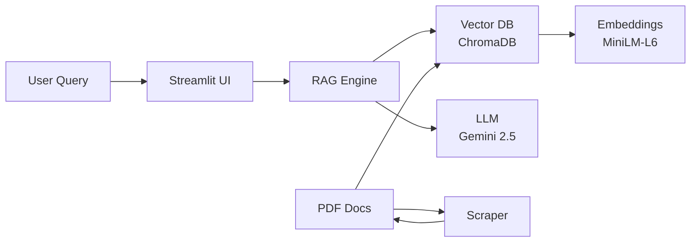

<div align="center">
  <a href="#hu" style="text-decoration:none; padding: 10px 20px; margin: 5px; background-color: #2a4a2a; color: #98fb98; border: 1px solid #50e050; border-radius: 5px; font-weight: bold;">🇭🇺 Magyar Dokumentáció</a>
  <a href="#en" style="text-decoration:none; padding: 10px 20px; margin: 5px; background-color: #4a4a2a; color: #f0e68c; border: 1px solid #e0c050; border-radius: 5px; font-weight: bold;">🇬🇧 English Documentation</a>
</div>
<br>

<a name="hu"></a>

# 🎓 Unibot - RAG Chatbot a Debreceni Egyetemhez

## Projekt Áttekintés

**Unibot** egy mesterséges intelligencia alapú chatbot, amely a Debreceni Egyetem hivatalos szabályzataiból épített tudásbázis alapján válaszol a hallgatók kérdéseire.

A projekt a **RAG (Retrieval-Augmented Generation)** architektúrát valósítja meg. Ez azt jelenti, hogy ahelyett, hogy az AI a saját általános tudását használná, először megkeresi a releváns információkat a lokálisan tárolt PDF szabályzatokból, és *kizárólag* ez alapján a kontextus alapján generálja meg a választ.

A felhasználói felületet a **Streamlit** biztosítja, a chatbot logikát a **LangChain** keretrendszer vezérli, a szemantikus keresést egy lokális **ChromaDB** vektor adatbázis végzi, a válaszok generálásáért pedig a **Google Gemini API** (`gemini-2.5-flash`) felel.

## ⚙️ Technológiai Összetevők (Tech Stack)

* **Felhasználói Felület (UI):** Streamlit
* **AI Keretrendszer:** LangChain
* **Nyelvi Modell (LLM):** Google Gemini API (`gemini-2.5-flash`)
* **Embedding Modell (Lokális):** Hugging Face `all-MiniLM-L6-v2` (CPU-n fut)
* **Vektor Adatbázis:** ChromaDB (lokális fájlrendszerben)
* **Adatgyűjtés (Scraping):** Python (`requests`, `BeautifulSoup4`)
* **Dokumentumkezelés:** `pypdf`

## 📂 Repozitórium Struktúra

A projekt főbb fájljai és azok funkciói:

* **`app/main.py`**: A fő Streamlit alkalmazás. Ez futtatja a webes felületet, kezeli a chat logikát, a memóriát (`st.session_state`), és összeköti a RAG folyamat elemeit (keresés -> prompt építés -> LLM hívás).
* **`app/rag_engine.py`**: RAG motor modul, tartalmazza a vektor adatbázis kezelését és az LLM inicializálást.
* **`app/config.py`**: Centralizált konfigurációs fájl (API kulcs, útvonalak, paraméterek).
* **`app/utils/scraping.py`**: Scraper szkript a Debreceni Egyetem szabályzatainak letöltéséhez.
* **`requirements.txt`**: Az összes szükséges Python csomag listája pinned verziókkal.
* **`.gitignore`**: Kritikus fontosságú Git konfigurációs fájl. Megakadályozza, hogy a titkos API kulcsod (`.env`), a virtuális környezeted (`.venv`), a generált adatbázis (`chroma_db/`) és a letöltött PDF-ek (`data/`) felkerüljenek a GitHubra.
* **`.env-example`**: Minta fájl, ami mutatja a felhasználóknak, hogy a `.env` fájlnak milyen változót kell tartalmaznia (pl. `GOOGLE_API_KEY=...`).
* **`LICENSE`**: MIT License fájl.

## 🚀 Telepítés és Futtatás

Az alábbi lépések szükségesek a projekt lokális futtatásához.

### 1. Klónozás és Előkészítés

Először klónozd a repozitóriumot a lokális gépedre:
```bash
git clone https://github.com/core-ter/de-unibot-ai.git
cd de-unibot-ai
```

### 2. Virtuális Környezet és Függőségek

Hozz létre egy Python virtuális környezetet és telepítsd a szükséges csomagokat:
```bash
python -m venv .venv
.venv\Scripts\activate  # Windows
# vagy
source .venv/bin/activate  # Linux/Mac

pip install -r requirements.txt
```

### 3. API Kulcs Beállítása

Hozz létre egy `.env` fájlt a projekt gyökerében a `.env-example` alapján:
```bash
GOOGLE_API_KEY="your_gemini_api_key_here"
```

A Gemini API kulcsot ingyenesen szerezhetsz be: [Google AI Studio](https://makersuite.google.com/app/apikey)

### 4. Adatgyűjtés (Scraping)

Töltsd le a szabályzatokat a Debreceni Egyetem weboldaláról:
```bash
python app/utils/scraping.py
```

Ez letölti az összes elérhető PDF-et a `data/` mappába.

### 5. Alkalmazás Indítása

Futtasd a Streamlit appot:
```bash
streamlit run app/main.py
```

Az alkalmazás megnyílik a böngésződben `http://localhost:8501` címen.

---

## 🏗️ Rendszer Architektúra



**Működési folyamat:**
1. Felhasználó kérdést tesz fel a Streamlit UI-ban
2. A kérdés embeddingjét elkészítjük (local model)
3. Szemantikus keresés a ChromaDB-ben (top 5 releváns chunk)
4. Prompt építése: context + history + kérdés
5. Gemini API hívás a válasz generálásához
6. Válasz megjelenítése a felhasználónak

---

## 🐛 Hibaelhárítás (Troubleshooting)

### "GOOGLE_API_KEY not set"
**Probléma:** Az API kulcs nincs beállítva vagy hibás.  
**Megoldás:** Ellenőrizd, hogy a `.env` fájlban szerepel-e az API kulcs és a helyes formátumban van:
```bash
GOOGLE_API_KEY=AIzaSy...
```

### "No module named 'chromadb'"
**Probléma:** Hiányzó dependency.  
**Megoldás:** Futtasd újra a telepítést:
```bash
pip install -r requirements.txt
```

### ChromaDB hiba újraindexeléskor
**Probléma:** A vektor adatbázis hibás vagy hiányos.  
**Megoldás:** Töröld a `chroma_db/` mappát és indítsd újra az appot:
```bash
# Windows
rmdir /s chroma_db
# Linux/Mac
rm -rf chroma_db/
```

### Lassú válaszidő
**Probléma:** Az első futtatáskor az embedding model letöltődik, ez időbe telhet.  
**Megoldás:** Várj türelemmel. Az újabb futtatások sokkal gyorsabbak lesznek.

### "No PDF files found"
**Probléma:** A `data/` mappában nincsenek PDF fájlok.  
**Megoldás:** Futtasd le először a scrapert:
```bash
python app/utils/scraping.py
```

---

## 📄 Licenc

Ez a projekt [MIT License](LICENSE) alatt érhető el.

---

## 🤝 Közreműködés

Javaslatokat, hibákat és pull requesteket szívesen fogadok! Nyiss egy issue-t vagy küldd be a PR-ed.

---

**Készítette:** Fenti  
**Egyetem:** Debreceni Egyetem  
**Projekt típus:** RAG-alapú AI Chatbot  
**GitHub Topics:** `rag` `chatbot` `langchain` `streamlit` `ai` `gemini` `chromadb` `python`